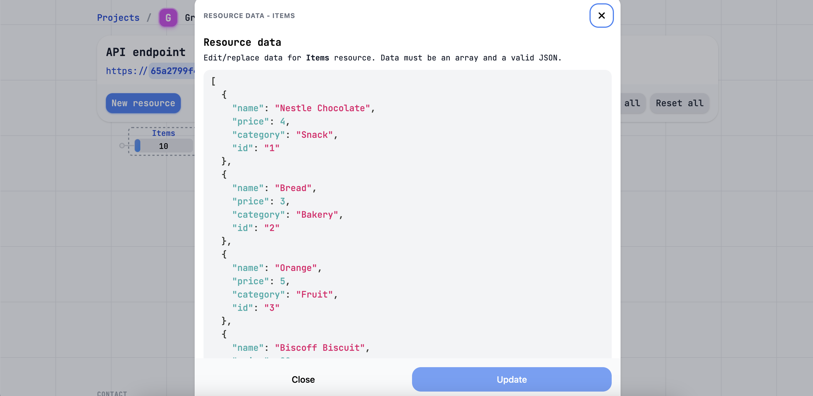
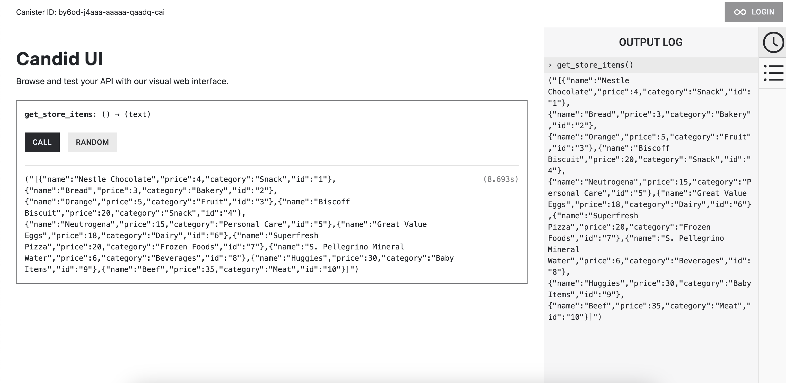

# Grocery Store

## Overview
This is an `ICP (Internet Computer Protocol)` project written in `Rust`. The smart contract included in the project gets some data from an api and displays it on the interface.

## How It Works
The data used is a list of items in a grocery store and was created with mockAPI. 
 


The contract (`src/grocery_store_backend/src/lib.rs`) makes a GET request to mockAPI. After deploying, the data can be displayed on CandidUI which is a user interface provided by ICP. We declare in `src/grocery_store_backend/grocery_store_backend.did` what to display on the UI.



Additionally, we need Cycles to burn to make our operations. For more information about Cycles visit https://internetcomputer.org/docs/current/developer-docs/gas-cost


## Running the project locally

If you want to test this project locally, you can use the following commands:

```bash
# Starts the replica, running in the background
dfx start --background

# Deploys your canisters to the replica and generates your candid interface
dfx deploy
```

Once the job completes, your application will be available at `http://localhost:4943?canisterId={asset_canister_id}`.

If you have made changes to your backend canister, you can generate a new candid interface with

```bash
npm run generate
```

at any time. This is recommended before starting the frontend development server, and will be run automatically any time you run `dfx deploy`.

If you are making frontend changes, you can start a development server with

```bash
npm start
```

Which will start a server at `http://localhost:8080`, proxying API requests to the replica at port 4943.

To learn more before you start working with Grocery Store, see the following documentation available online:

- [Quick Start](https://internetcomputer.org/docs/current/developer-docs/setup/deploy-locally)
- [SDK Developer Tools](https://internetcomputer.org/docs/current/developer-docs/setup/install)
- [Rust Canister Development Guide](https://internetcomputer.org/docs/current/developer-docs/backend/rust/)
- [ic-cdk](https://docs.rs/ic-cdk)
- [ic-cdk-macros](https://docs.rs/ic-cdk-macros)
- [Candid Introduction](https://internetcomputer.org/docs/current/developer-docs/backend/candid/)
